## 🎨 Frontend Mentor Challenge Solutions 🎨

This is a collection of my solutions to challenges on [Frontend Mentor](https://frontendmentor.io).

Each project showcases a variety of skills and technologies used in modern development.

Below are a list of these projects, the latest on top, with links to the live sites, code repositories, and the original challenge descriptions.

## 📚 Project List

### Projects finished in 2026

 

<!-- Loopstudios Landing Page solution -->
<table align="center">
  <tr>
    <td width="50%">
      <h2 align="center">Loopstudios Landing Page</h2>
      <h3 align="center">
        
      </h3>
      

        <a href="https://fe-26-004-loopstudios-landing-page.netlify.app/" target="_blank">Live</a> | <a href="https://github.com/katrien-s/fe-26-004-loopstudios-landing-page" target="_blank">Repo</a>
      

    </td>
    <td width="50%">
      <picture>
        <a href="https://fe-26-004-loopstudios-landing-page.netlify.app/" target="_blank">
          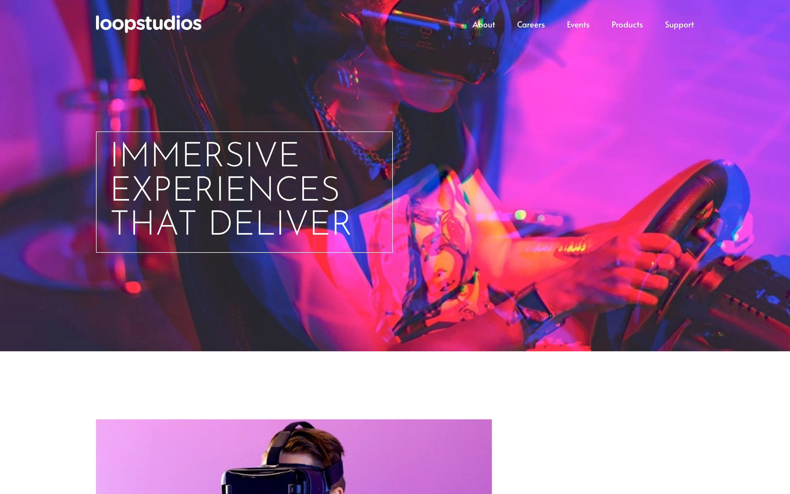
        </a>
      </picture>
    </td>
  </tr>
</table>

<!-- Fylo dark theme landing page solution -->
<table align="center">
  <tr>
    <td width="50%">
      <h2 align="center">Fylo dark theme landing page</h2>
      <h3 align="center">
        
      </h3>
      

        <a href="https://fe-26-003-fylo-dark-theme-landing-pag.netlify.app/" target="_blank">Live</a> | <a href="https://github.com/katrien-s/fe-26-003-fylo-dark-theme-landing-page" target="_blank">Repo</a>
      

    </td>
    <td width="50%">
      <picture>
        
      </picture>
    </td>
  </tr>
</table>

<!-- Tech book club landing page solution -->
<table align="center">
  <tr>
    <td width="50%">
      <h2 align="center">Tech book club landing page solution</h2>
      <h3 align="center">
        
      </h3>
      

        <a href="https://fe-26-002-tech-book-club-landing-page.netlify.app/" target="_blank">Live</a> | <a href="https://github.com/katrien-s/fe-26-002-tech-book-club-landing-page" target="_blank">Repo</a>
      

    </td>
    <td width="50%">
      <picture>
        
      </picture>
    </td>
  </tr>
</table>

<!-- Bento Grid Solution -->
<table align="center">
  <tr>
    <td width="50%">
      <h2 align="center">Bento Grid Solution</h2>
      <h3 align="center">
        
      </h3>
      

        <a href="https://fe-26-001-bento-grid.netlify.app/" target="_blank">Live</a> | <a href="https://github.com/katrien-s/fe-26-001-bento-grid" target="_blank">Repo</a>
      

    </td>
    <td width="50%">
      <picture>
        <a href="https://fe-26-001-bento-grid.netlify.app/" target="_blank">
          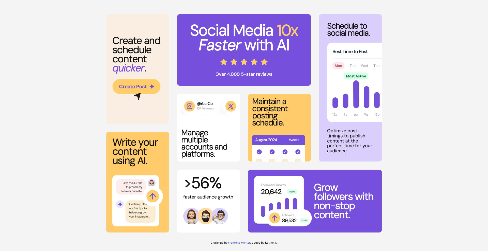
        </a>
      </picture>
    </td>
  </tr>
</table>

### Projects finished in 2025

 

<!-- GitHub User Search App -->
<table align="center">
  <tr>
    <td width="50%">
      <h2 align="center">GitHub User Search App</h2>
      <h3 align="center">
        
      </h3>
      

        <a href="https://fe-25-006-github-user-search-app.netlify.app/" target="_blank">Live</a> | <a href="https://github.com/katrien-s/fe-25-006-github-user-search-app" target="_blank">Repo</a>
      

    </td>
    <td width="50%">
      <picture>
        <a href="https://fe-25-006-github-user-search-app.netlify.app/" target="_blank">
          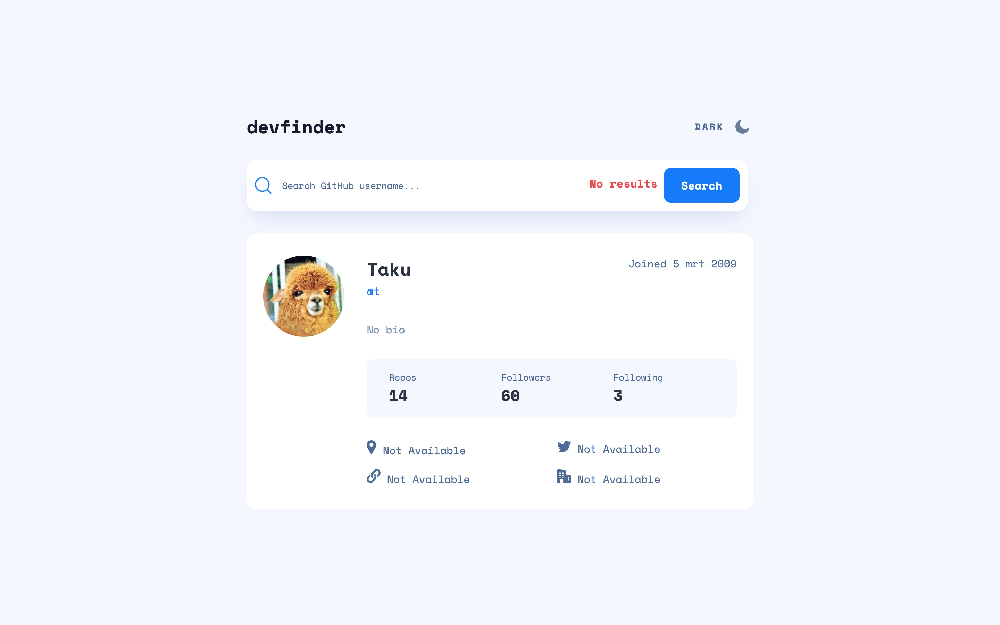
        </a>
      </picture>
    </td>
  </tr>
</table>

 

<!-- Fylo Data Storage Component -->
<table align="center">
  <tr>
    <td width="50%">
      <h2 align="center">Fylo Data Storage Component</h2>
      <h3 align="center">
        
      </h3>
      

        <a href="https://fe-25-005-fylo-data-storage-component.netlify.app/" target="_blank">Live</a> | <a href="https://github.com/katrien-s/fe-25-005-fylo-data-storage-component" target="_blank">Repo</a>
      

    </td>
    <td width="50%">
      <picture>
        <a href="https://fe-25-005-fylo-data-storage-component.netlify.app/" target="_blank">
          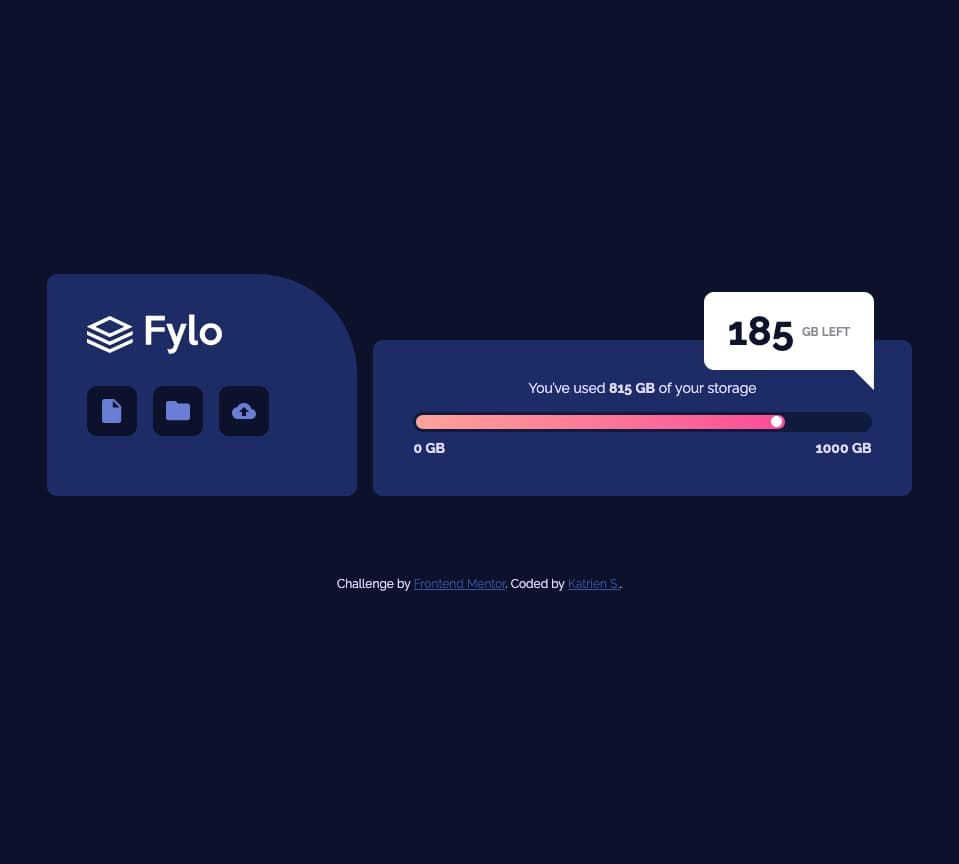
        </a>
      </picture>
    </td>
  </tr>
</table>

 

<!-- Tip Calculator App -->
<table align="center">
  <tr>
    <td width="50%">
      <h2 align="center">Tip Calculator App</h2>
      <h3 align="center">
        
      </h3>
      

        <a href="https://fe-25-003-tip-calculator-app.netlify.app/" target="_blank">Live</a> | <a href="https://github.com/katrien-s/fe-25-003-tip-calculator-app" target="_blank">Repo</a>
      

    </td>
    <td width="50%">
      <picture>
        <a href="https://fe-25-003-tip-calculator-app.netlify.app/" target="_blank">
          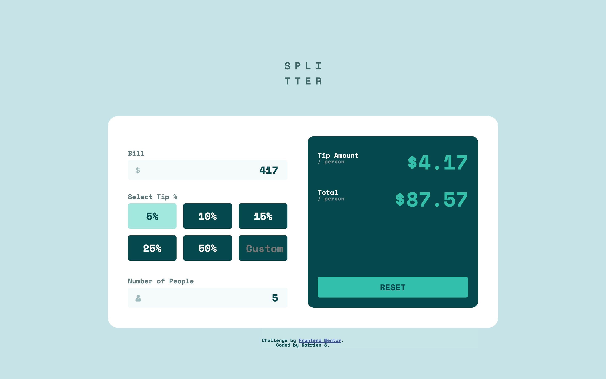
        </a>
      </picture>
    </td>
  </tr>
</table>

 

<!-- Contact Form -->
<table align="center">
  <tr>
    <td width="50%">
      <h2 align="center">Contact Form</h2>
      <h3 align="center">
        
      </h3>
      

        <a href="https://fe-25-004-contact-form.netlify.app/" target="_blank">Live</a> | <a href="https://github.com/katrien-s/fe-25-004-contact-form" target="_blank">Repo</a>
      

    </td>
    <td width="50%">
      <picture>
        <a href="https://fe-25-004-contact-form.netlify.app/" target="_blank">
          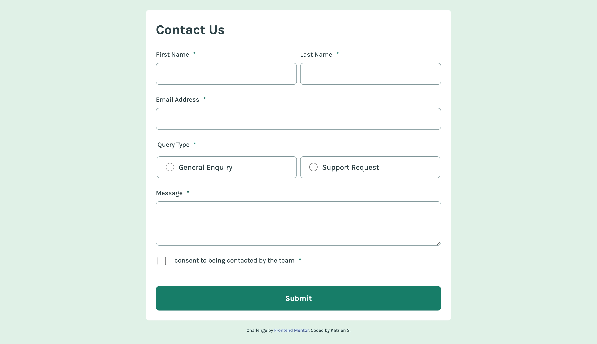
        </a>
      </picture>
    </td>
  </tr>
</table>

 

<!-- Time Tracking Dashboard -->
<table align="center">
  <tr>
    <td width="50%">
      <h2 align="center">Time Tracking Dashboard</h2>
      <h3 align="center">
        
      </h3>
      

        <a href="https://fe-25-002-time-tracking-dashboard.netlify.app/" target="_blank">Live</a> | <a href="https://github.com/katrien-s/fe-25-002-time-tracking-dashboard" target="_blank">Repo</a>
      

    </td>
    <td width="50%">
      <picture>
        <a href="https://fe-25-002-time-tracking-dashboard.netlify.app/" target="_blank">
          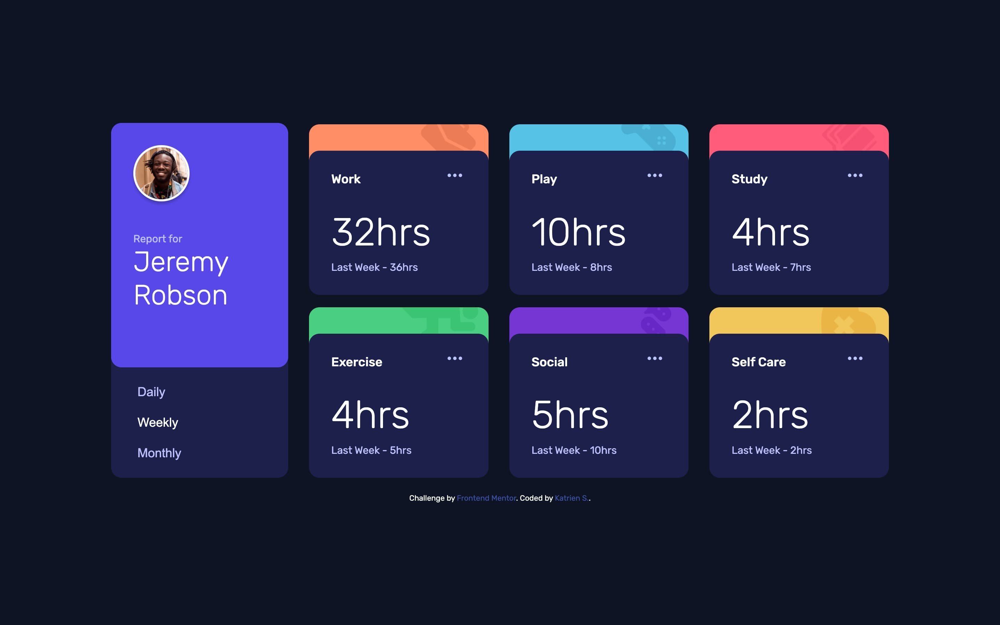
        </a>
      </picture>
    </td>
  </tr>
</table>

 

<!-- Blog Preview Card -->
<table align="center">
  <tr>
    <td width="50%">
      <h2 align="center">Blog Preview Card</h2>
      <h3 align="center">
        
      </h3>
      

        <a href="https://fe-25-001-blog-preview-card.vercel.app" target="_blank">Live</a> | <a href="https://github.com/katrien-s/fe-25-001-blog-preview-card" target="_blank">Repo</a>
      

    </td>
    <td width="50%">
      <picture>
        <a href="https://fe-25-001-blog-preview-card.vercel.app" target="_blank">
          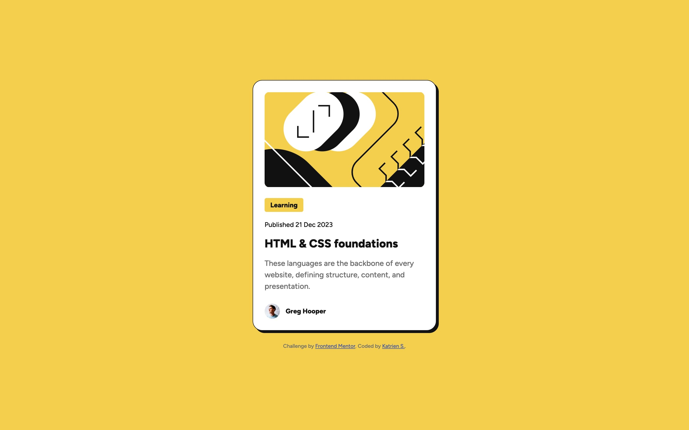
        </a>
      </picture>
    </td>
  </tr>
</table>

 

### Projects finished in 2024

 

<!-- Social Media Theme Switcher -->
<table align="center">
  <tr>
    <td width="50%">
      <h2 align="center">Social Media Dashboard with Theme Switcher</h2>
      <h3 align="center">
        
      </h3>
      

        <a href="https://fe-24-012-social-media-dashboard-with-theme-switcher-master.vercel.app/" target="_blank">Live</a> | <a href="https://github.com/katrien-s/fe-24-012-social-media-dashboard-with-theme-switcher-master" target="_blank">Repo</a>
      

    </td>
    <td width="50%">
      <picture>
        <a href="https://fe-24-012-social-media-dashboard-with-theme-switcher-master.vercel.app/" target="_blank">
          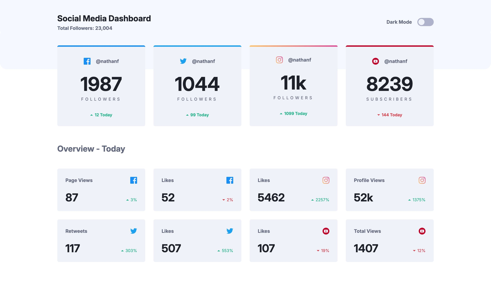
        </a>
      </picture>
    </td>
  </tr>
</table>

 

<!-- Suite Landing Page -->
<table align="center">
  <tr>
    <td width="50%">
      <h2 align="center">Suite Landing Page</h2>
      <h3 align="center">
        
      </h3>
      

        <a href="https://fe-24-011-suite-landing-page.vercel.app/" target="_blank">Live</a> | <a href="https://github.com/katrien-s/fe-24-011-suite-landing-page" target="_blank">Repo</a>
      

    </td>
    <td width="50%">
      <picture>
        <a href="https://fe-24-011-suite-landing-page.vercel.app/" target="_blank">
          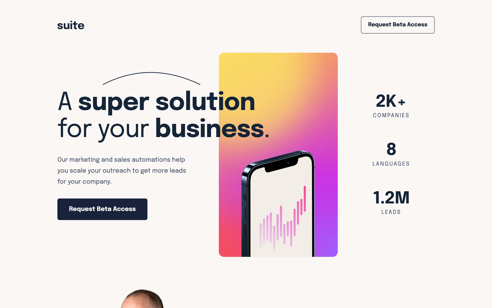
        </a>
      </picture>
    </td>
  </tr>
</table>

 

<!-- Typemaster Pre-launch Landing Page -->
<table align="center">
  <tr>
    <td width="50%">
      <h2 align="center">Typemaster Pre-launch Landing Page</h2>
      <h3 align="center">
        
      </h3>
      

        <a href="https://moonlit-stroopwafel-a56dfd.netlify.app/" target="_blank">Live</a>
         | 
        <a href="https://github.com/katrien-s/fe-24-008-typemaster-pre-launch-landing-page" target="_blank">Repo</a>
      

    </td>
    <td width="50%">
      <picture>
        <a href="https://moonlit-stroopwafel-a56dfd.netlify.app/" target="_blank">
          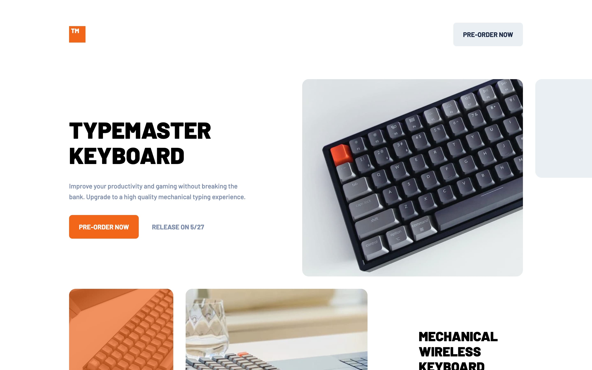
        </a>
      </picture>
    </td>
  </tr>
</table>

 

<!-- Art Gallery Website -->
<table align="center">
  <tr>
    <td width="50%">
      <h2 align="center">Art Gallery Website</h2>
      <h3 align="center">
        
      </h3>
      

        <a href="https://fe-16-art-gallery-website.vercel.app/" target="_blank">Live</a>
         | 
        <a href="https://github.com/katrien-s/fe-16-art-gallery-website" target="_blank">Repo</a>
      

    </td>
    <td width="50%">
      <picture>
        <a href="https://fe-16-art-gallery-website.vercel.app/" target="_blank">
          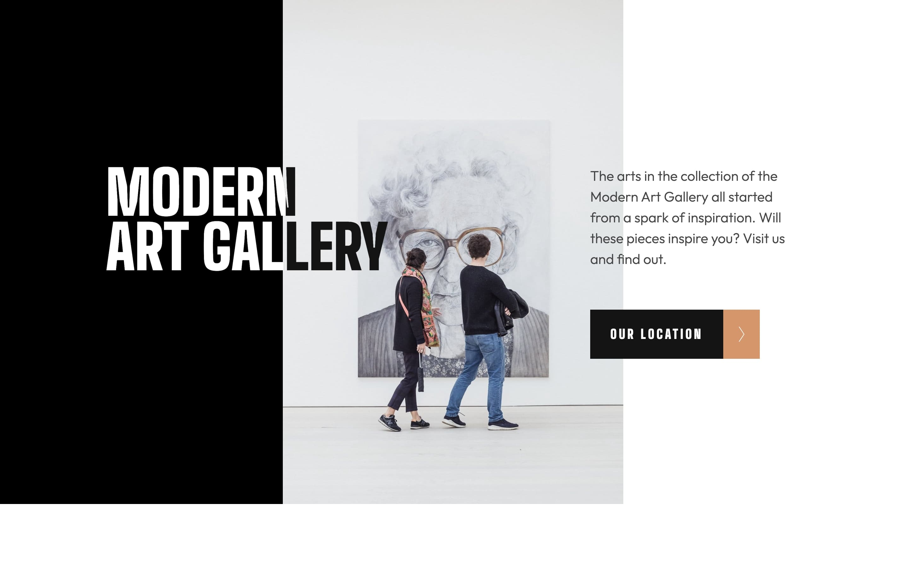
        </a>
      </picture>
    </td>
  </tr>
</table>

 

<!-- Single-page Developer Portfolio -->
<table align="center">
  <tr>
    <td width="50%">
      <h2 align="center">Single-page Developer Portfolio</h2>
      <h3 align="center">
        
      </h3>
      

        <a href="https://fe-24-006-single-page-developer-portfolio.vercel.app/" target="_blank">Live</a>
         | 
        <a href="https://github.com/katrien-s/fe-24-006-single-page-developer-portfolio" target="_blank">Repo</a>
      

    </td>
    <td width="50%">
      <picture>
        <a href="https://fe-24-006-single-page-developer-portfolio.vercel.app/" target="_blank">
          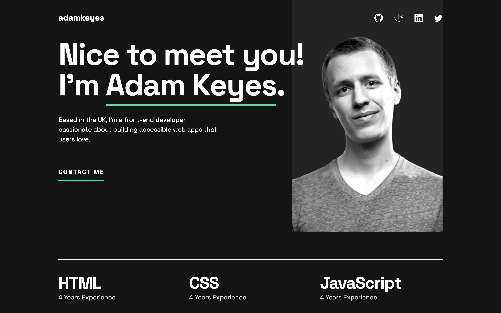
        </a>
      </picture>
    </td>
  </tr>
</table>

 

<!-- FAQ Accordion -->
<table align="center">
  <tr>
    <td width="50%">
      <h2 align="center">FAQ Accordion</h2>
      <h3 align="center">
        
      </h3>
      

        <a href="https://velvety-fox-b8ed78.netlify.app/" target="_blank">Live</a>
         | 
        <a href="https://github.com/katrien-s/fe-24-009-faq-accordion" target="_blank">Repo</a>
      

    </td>
    <td width="50%">
      <picture>
        <a href="https://velvety-fox-b8ed78.netlify.app/" target="_blank">
          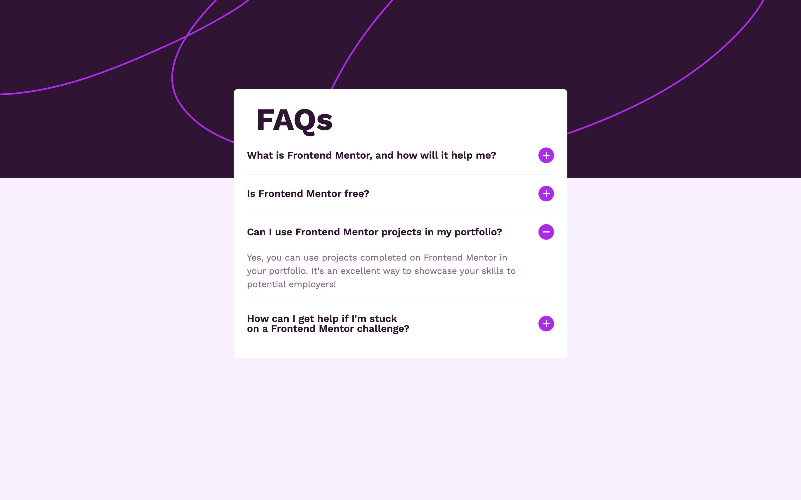
        </a>
      </picture>
    </td>
  </tr>
</table>

 

<!-- Social Links Profile -->
<table align="center">
  <tr>
    <td width="50%">
      <h2 align="center">Social Links Profile</h2>
      <h3 align="center">
        
      </h3>
      

        <a href="https://gregarious-fairy-456038.netlify.app/" target="_blank">Live</a>
         | 
        <a href="https://github.com/katrien-s/fe-24-010-social-links-profile" target="_blank">Repo</a>
      

    </td>
    <td width="50%">
      <picture>
        <a href="https://gregarious-fairy-456038.netlify.app/" target="_blank">
          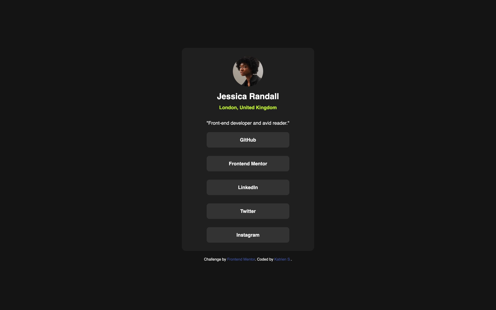
        </a>
      </picture>
    </td>
  </tr>
</table>

 

<!-- Workit Landing Page -->
<table align="center">
  <tr>
    <td width="50%">
      <h2 align="center">Workit Landing Page</h2>
      <h3 align="center">
        
      </h3>
      

        <a href="https://tangerine-tapioca-d62fea.netlify.app/" target="_blank">Live</a>
         | 
        <a href="https://github.com/katrien-s/fe-24-005-workit-landing-page" target="_blank">Repo</a>
      

    </td>
    <td width="50%">
      <picture>
        <a href="https://tangerine-tapioca-d62fea.netlify.app/" target="_blank">
          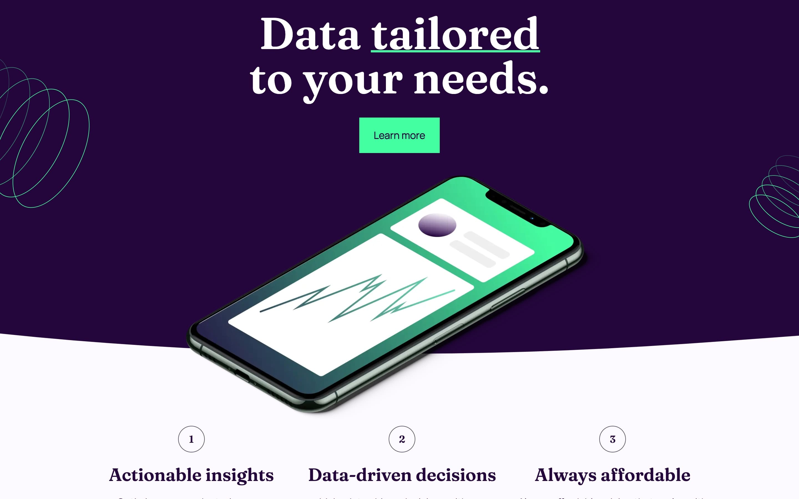
        </a>
      </picture>
    </td>
  </tr>
</table>

 

<!-- News Homepage -->
<table align="center">
  <tr>
    <td width="50%">
      <h2 align="center">News Homepage</h2>
      <h3 align="center">
        
      </h3>
      

        <a href="https://fe-24-007-news-homepage.vercel.app/" target="_blank">Live</a>
         | 
        <a href="https://github.com/katrien-s/fe-24-007-news-homepage" target="_blank">Repo</a>
      

    </td>
    <td width="50%">
      <picture>
        <a href="https://fe-24-007-news-homepage.vercel.app/" target="_blank">
          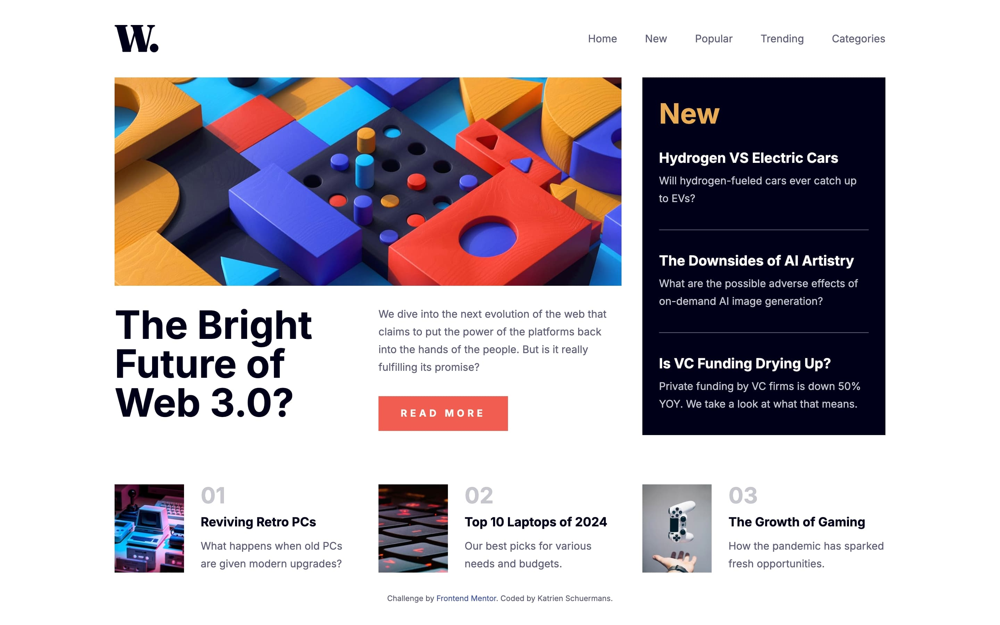
        </a>
      </picture>
    </td>
  </tr>
</table>

 

<!-- Age Calculator -->
<table align="center">
  <tr>
    <td width="50%">
      <h2 align="center">Age Calculator</h2>
      <h3 align="center">
        
      </h3>
      

        <a href="https://cheerful-squirrel-f1af5a.netlify.app/" target="_blank">Live</a>
         | 
        <a href="https://github.com/katrien-s/fe-24-003-age-calculator-app" target="_blank">Repo</a>
      

    </td>
    <td width="50%">
      <picture>
        <a href="https://cheerful-squirrel-f1af5a.netlify.app/" target="_blank">
          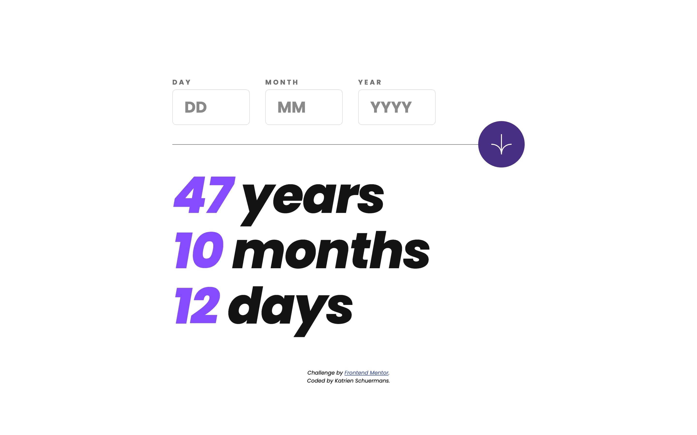
        </a>
      </picture>
    </td>
  </tr>
</table>

 

<!-- Pricing Component with Toggle -->
<table align="center">
  <tr>
    <td width="50%">
      <h2 align="center">Pricing Component with Toggle</h2>
      <h3 align="center">
        
      </h3>
      

        <a href="https://magnificent-basbousa-ebe39d.netlify.app/" target="_blank">Live</a>
         | 
        <a href="https://github.com/katrien-s/fe-24-002-pricing-component-with-toggle" target="_blank">Repo</a>
      

    </td>
    <td width="50%">
      <picture>
        <a href="https://magnificent-basbousa-ebe39d.netlify.app/" target="_blank">
          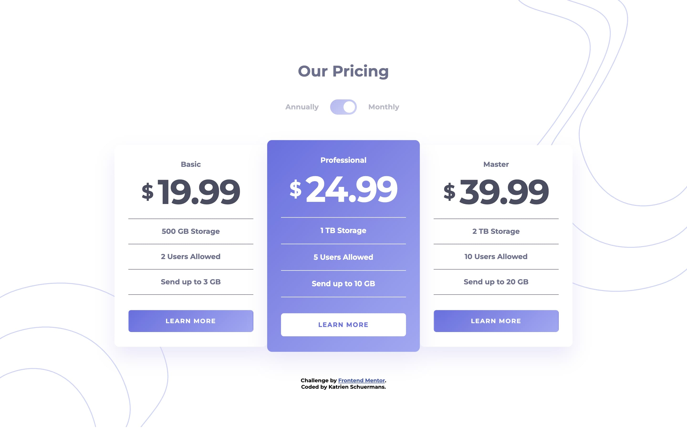
        </a>
      </picture>
    </td>
  </tr>
</table>

 

<!-- Results Summary Component -->
<table align="center">
  <tr>
    <td width="50%">
      <h2 align="center">Results Summary Component</h2>
      <h3 align="center">
        
      </h3>
      

        <a href="https://grand-macaron-f3b01e.netlify.app/" target="_blank">Live</a>
         | 
        <a href="https://github.com/katrien-s/fe-24-001-results-summary-component" target="_blank">Repo</a>
      

    </td>
    <td width="50%">
      <picture>
        <a href="https://grand-macaron-f3b01e.netlify.app/" target="_blank">
          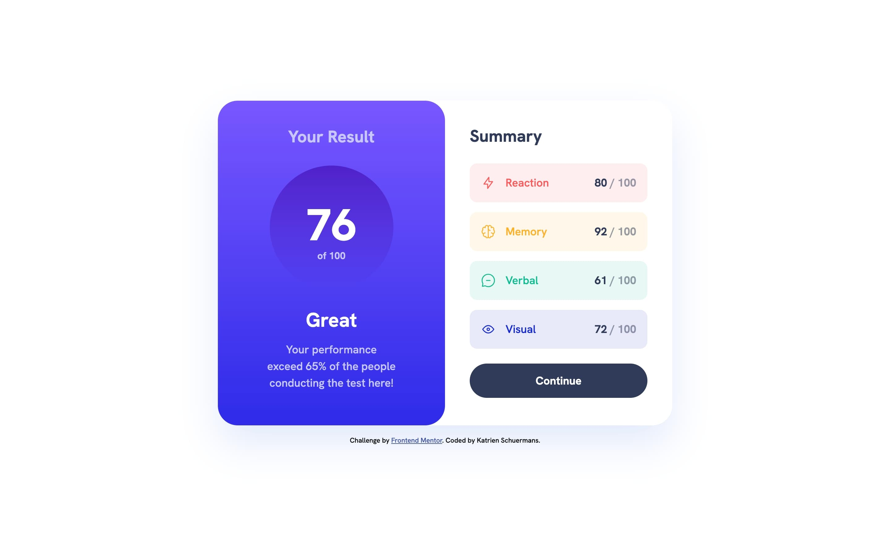
        </a>
      </picture>
    </td>
  </tr>
</table>

 
