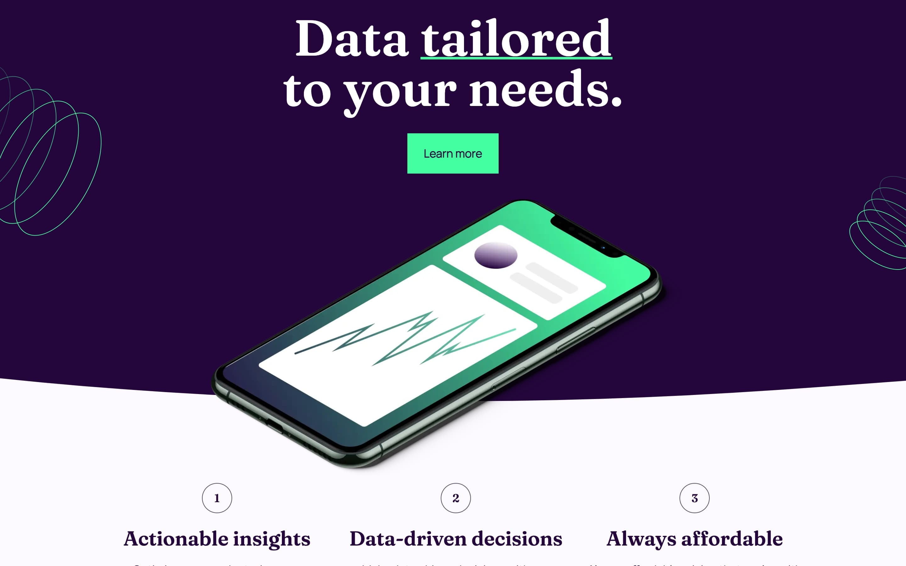

## 🎨 Frontend Mentor Challenge Solutions 🎨

This is a collection of my solutions to challenges on [Frontend Mentor](https://frontendmentor.io).

Each project showcases a variety of skills and technologies used in modern development.

Below are a list of these projects, the latest on top, with links to the live sites, code repositories, and the original challenge descriptions.

## 📚 Project List

### Projects finished in 2024

 

<!-- Suite Landing Page -->
<table align="center">
  <tr>
    <td width="50%">
      <h2 align="center">Suite Landing Page</h2>
      <h3 align="center">
        
      </h3>
      

        <a href="https://fe-24-011-suite-landing-page.vercel.app/" target="_blank">Live</a> | <a href="https://github.com/katrien-s/fe-24-011-suite-landing-page" target="_blank">Repo</a>
      

    </td>
    <td width="50%">
      <picture>
        
      </picture>
    </td>
  </tr>
</table>

 

<!-- Typemaster Pre-launch Landing Page -->
<table align="center">
  <tr>
    <td width="50%">
      <h2 align="center">Typemaster Pre-launch Landing Page</h2>
      <h3 align="center">
        
      </h3>
      

        <a href="https://moonlit-stroopwafel-a56dfd.netlify.app/" target="_blank">Live</a>
         | 
        <a href="https://github.com/katrien-s/fe-24-008-typemaster-pre-launch-landing-page" target="_blank">Repo</a>
      

    </td>
    <td width="50%">
      <picture>
        
      </picture>
    </td>
  </tr>
</table>

 

<!-- Art Gallery Website -->
<table align="center">
  <tr>
    <td width="50%">
      <h2 align="center">Art Gallery Website</h2>
      <h3 align="center">
        
      </h3>
      

        <a href="https://fe-16-art-gallery-website.vercel.app/" target="_blank">Live</a>
         | 
        <a href="https://github.com/katrien-s/fe-16-art-gallery-website" target="_blank">Repo</a>
      

    </td>
    <td width="50%">
      <picture>
        
      </picture>
    </td>
  </tr>
</table>

 

<!-- Single-page Developer Portfolio -->
<table align="center">
  <tr>
    <td width="50%">
      <h2 align="center">Single-page Developer Portfolio</h2>
      <h3 align="center">
        
      </h3>
      

        <a href="https://fe-24-006-single-page-developer-portfolio.vercel.app/" target="_blank">Live</a>
         | 
        <a href="https://github.com/katrien-s/fe-24-006-single-page-developer-portfolio" target="_blank">Repo</a>
      

    </td>
    <td width="50%">
      <picture>
        
      </picture>
    </td>
  </tr>
</table>

 

<!-- FAQ Accordion -->
<table align="center">
  <tr>
    <td width="50%">
      <h2 align="center">FAQ Accordion</h2>
      <h3 align="center">
        
      </h3>
      

        <a href="https://velvety-fox-b8ed78.netlify.app/" target="_blank">Live</a>
         | 
        <a href="https://github.com/katrien-s/fe-24-009-faq-accordion" target="_blank">Repo</a>
      

    </td>
    <td width="50%">
      <picture>
        
      </picture>
    </td>
  </tr>
</table>

 

<!-- Social Links Profile -->
<table align="center">
  <tr>
    <td width="50%">
      <h2 align="center">Social Links Profile</h2>
      <h3 align="center">
        
      </h3>
      

        <a href="https://gregarious-fairy-456038.netlify.app/" target="_blank">Live</a>
         | 
        <a href="https://github.com/katrien-s/fe-24-010-social-links-profile" target="_blank">Repo</a>
      

    </td>
    <td width="50%">
      <picture>
        
      </picture>
    </td>
  </tr>
</table>

 

<!-- Workit Landing Page -->
<table align="center">
  <tr>
    <td width="50%">
      <h2 align="center">Workit Landing Page</h2>
      <h3 align="center">
        
      </h3>
      

        <a href="https://tangerine-tapioca-d62fea.netlify.app/" target="_blank">Live</a>
         | 
        <a href="https://github.com/katrien-s/fe-24-005-workit-landing-page" target="_blank">Repo</a>
      

    </td>
    <td width="50%">
      <picture>
        
      </picture>
    </td>
  </tr>
</table>

 

<!-- News Homepage -->
<table align="center">
  <tr>
    <td width="50%">
      <h2 align="center">News Homepage</h2>
      <h3 align="center">
        
      </h3>
      

        <a href="https://fe-24-007-news-homepage.vercel.app/" target="_blank">Live</a>
         | 
        <a href="https://github.com/katrien-s/fe-24-007-news-homepage" target="_blank">Repo</a>
      

    </td>
    <td width="50%">
      <picture>
        
      </picture>
    </td>
  </tr>
</table>

 

<!-- Age Calculator -->
<table align="center">
  <tr>
    <td width="50%">
      <h2 align="center">Age Calculator</h2>
      <h3 align="center">
        
      </h3>
      

        <a href="https://cheerful-squirrel-f1af5a.netlify.app/" target="_blank">Live</a>
         | 
        <a href="https://github.com/katrien-s/fe-24-003-age-calculator-app" target="_blank">Repo</a>
      

    </td>
    <td width="50%">
      <picture>
        
      </picture>
    </td>
  </tr>
</table>

 

<!-- Pricing Component with Toggle -->
<table align="center">
  <tr>
    <td width="50%">
      <h2 align="center">Pricing Component with Toggle</h2>
      <h3 align="center">
        
      </h3>
      

        <a href="https://magnificent-basbousa-ebe39d.netlify.app/" target="_blank">Live</a>
         | 
        <a href="https://github.com/katrien-s/fe-24-002-pricing-component-with-toggle" target="_blank">Repo</a>
      

    </td>
    <td width="50%">
      <picture>
        
      </picture>
    </td>
  </tr>
</table>

 

<!-- Results Summary Component -->
<table align="center">
  <tr>
    <td width="50%">
      <h2 align="center">Results Summary Component</h2>
      <h3 align="center">
        
      </h3>
      

        <a href="https://grand-macaron-f3b01e.netlify.app/" target="_blank">Live</a>
         | 
        <a href="https://github.com/katrien-s/fe-24-001-results-summary-component" target="_blank">Repo</a>
      

    </td>
    <td width="50%">
      <picture>
        
      </picture>
    </td>
  </tr>
</table>

 
